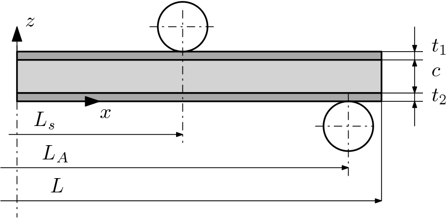

# Four-Point Bending Test With Sandwich Material
Tested with CGX 2.10 / CCX 2.9

+ Non-linear static analysis
+ Plasticity
+ Penalty contact
+ Symmetry reduction

File                       | Contents    
 :-------------            | :-------------
 [values.fbl](values.fbl)  | CGX script, parameter values
 [pre.fbl](pre.fbl)        | CGX script, pre-processing
 [post.fbl](post.fbl)      | CGX script, post-processing, images and movie
 [Biegung.inp](Test.inp)      | CCX input

The model represents a four point bending test on a elasto-plastic sandwich plate. The face material is mild steel, the core material is aluminum foam.



## Pre-Processing


You may edit the file [values.fbl](values.fbl) and then run
```
> cgx -b pre.fbl
```


In order to avoid stress averaging between core and face sheets, they are meshed separately and connected via equations. The equations are generated in CGX using
```
send <dep> <indep> abq areampc 123
```
Care must be taken to not further constrain the (eliminated) dependent nodes. They are explicitly removed from the node sets for the symmetry constraints.

The cylinders interact with the specimen via penalty contact with the cylinders being the dependent surfaces.

The lower outer cylinder is fixed, the inner upper cylinder is moved down 20 mm.

## Solving
The rate of convergence is affected by the plastic material, the mesh density in the contact region, the contact stiffness and the time incrementation controls.
```
> ccx Biegung
```


## Post-Processing
```
> cgx -b post.fbl
```
The yield stress of the face sheets is much higher than that of the core. The specimen fails by core shear, the center zone with pure bending load remains in the elastic range.


