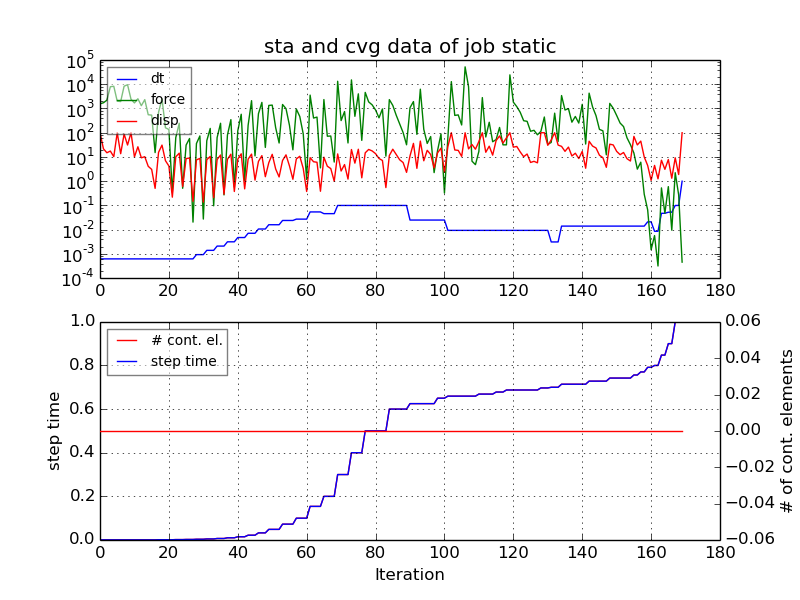
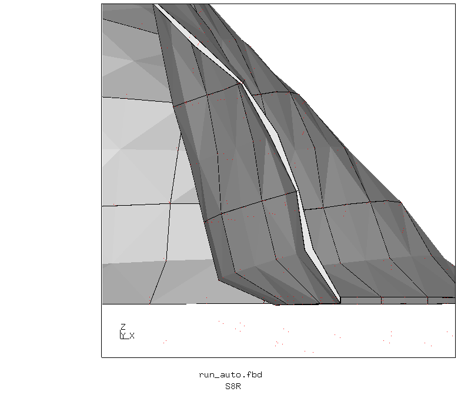

# Inflating a Pillow
Tested with CGX/CCX 2.11

+ Non-linear static solution
+ Shell elements
+ Symmetry expansion in the post-processing

File                    | Contents    
 :-------------         | :-------------
 [pre.fbd](pre.fbd)     | Pre-processing script for CGX     
 [post.fbd](post.fbd)   | Post-processing script for CGX
 [static.inp](static.inp) | CCX input
 [test.py](test.py) | Python script for automatic re-calculation

## Automatic test run
Run the analysis for the element types S8R, S8, S4R and S4:
```
> ./test.py
```
This will pop up the convergence plot and cgx for each run. Close these windows to continue the loop

The script sets the element type in [pre.fbd](pre.fbd) and edits the ccx
element type in the exported file `all.msh`. Then, the analysis is run
and the result plots are generated and renamed according to the element type.

## Preprocessing
```
> cgx -b pre.fbd
```


## Solving
The problem involves heavy buckling and challenges the non-linear solver. In order to obtain a solution, the convergence criteria are relaxed in the first step. In the second step, the default values are restored. For the given parameters in the stored example, this is not relevant, as the solution at the end of step 1 already meets the default criteria.
```
> ccx static
> monitor.py static
```


## Postprocessing
To give an impression of the complete pillow, symmetry expansion in all three directions is used.
```
> cgx -b post.fbd
```
 

The single layer of C3D20R-Elements, which is generated by CCX to represent the shell elements, exhibits hourglassing. This severely affects the bending stiffness and adds instabilities to the model.



## Variation of the element type

Here, results of a comparison for the element types S4, S4R, S8 and S8R is given. S8 and S4R elements require manual editing of all.msh, as these can't be adressed directly from CGX.

|Type in CGX | Type in CCX | max D | Iterations |
|:--         | :--         | :--   | :--        |
|qu8         | S8R         | 44.8  | 169        |
|            | S8          | 36.9  | 82         |
|qu4         | S4          | 37.6  | 157 (60%)  |
|            | S4R         | 36.2  | 58         |

### Convergence

|    |     |
|:-- | :-- |
|S8R | S8  |
|S4  | S4R |


### Deformation


### Cut view


