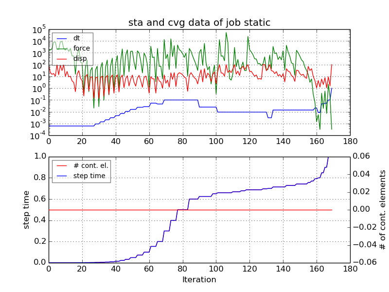

# Inflating a Pillow
Tested with CGX 2.10 / CCX 2.9

+ Non-linear static solution
+ Shell elements
+ Symmetry expansion in the post-processing

File                    | Contents    
 :-------------         | :-------------
 [pre.fbd](pre.fbd)     | Pre-processing script for CGX     
 [post.fbd](post.fbd)   | Post-processing script for CGX
 [static.inp](static.inp) | CCX input

## Preprocessing
```
> cgx -b pre.fbd
```


## Solving
The problem involves heavy buckling and challenges the non-linear solver. In order to obtain a solution, the convergence criteria are relaxed in the first step. In the second step, the default values are restored. For the given parameters in the stored example, this is not relevant, as the solution at the end of step 1 already meets the default criteria.
```
> ccx static
> ../Scripts/monitor.py static
```


## Postprocessing
To give an impression of the complete pillow, symmetry expansion in all three directions is used.
```
> cgx -b post.fbd
```
 

The single layer of C3D20R-Elements, which is generated by CCX to represent the shell elements, exhibits hourglassing. This severely affects the bending stiffness and adds instabilities to the model.


