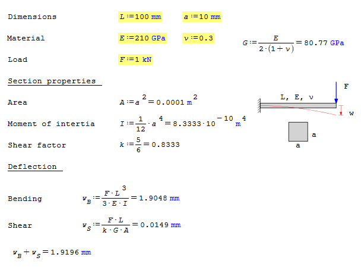

# Beam Sections

Tested with CGX 2.13.1 / CCX 2.13

+ Test of beam elements

File                           | Contents    
:-------------                 | :-------------
[u1general.inp](u1general.inp) | CCX input for user element U1 with general beam section
[u1.plt](u1.plt)               | Gnuplot script for the U1 example
[test.py](test.py)             | Python script to run the full simulation


## Cantilever beam with point load

Structure: Cantilever beam (length 100 mm, square section 10 x 10 mm) with a point load of 1 kN at the free end. Material is
steel with E = 210 GPa and nu = 0.3.

### Reference solution

Click the image below to open a life worksheet:
[](https://en.smath.info/cloud/worksheet/RGoTsp3s)

### User element U1 with general section

This element is mentioned in the CCX handbook version 2.13 in section 6.2.45.

```
*ELEMENT, TYPE=U1, ELSET=Eall
1,      1,      2,
...
*USER ELEMENT,TYPE=U1,NODES=2,INTEGRATION POINTS=2,MAXDOF=6
...
*BEAM SECTION,ELSET=Eall,MATERIAL=EL,SECTION=GENERAL
100.,833.3,0.,833.3,0.8333
0.,1.,0.
...
```
For meshing you can specify be2 elements in CGX and then rename the element type to U1 in the mesh file.
In the given example, the mesh was generated manually directly in the INP file.

Run the analyis, extract the data and plot the displacement:
```
> ccx u1general
> sed -n '4,14 p' u1general.dat > u1.txt
> gnuplot u1.gpl
```
The field results (FRD) are unusable. They neither contain the mesh nor any results.
For results checking you have to rely on the DAT file.

The following image shows the displacement UZ and the rotation RY along the beam.


