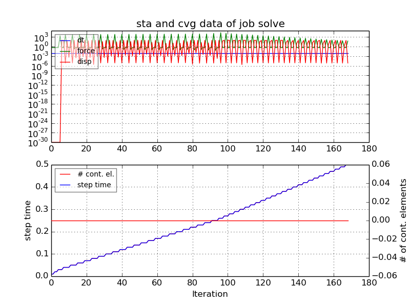

# Thermal Strain
Tested with CGX/CCX 2.10

+ Transient coupled thermo-mechanical analysis
+ Stress due to non-homogeneous temperature
+ Time history plot

File                       | Contents    
 :-------------            | :-------------
 [pre.fbl](pre.fbl)        | CGX script, pre-processing
 [solve.inp](solve.inp)    | CCX input
 [post.fbl](post.fbl)      | CGX script, post-processing, images and plots
 [anim.fbl](anim.fbl)      | CGX script, movie
 [history.gnu](history.gnu)| Gnuplot script for the time history plot

The model represents a cantilever plate. The upper face is exposed to a heat
impulse (excitation), defined by a time-dependent heat flux density.

A cross-thickness temperature gradient develops and remains for the duration of
the excitation time.

Corresponding to the temperature gradient, a strain gradient develops. which leads to
a curvature (bending) of the plate.


## Pre-Processing
```
> cgx -b pre.fbl
```
The geometry consists of a single brick with a structured hex mesh (C3D8I elements).
The element size is biased (smaller at the support) because of the higher
longitudinal temperature gradients.

A set with a single node at the tip is defined for history plot generation.


## Solving

The analysis is done with the `*coupled temperature-displacement` procedure using
fixed time increments. During the excitation (approx. half of the total time), the convergence
is slightly slower than afterwards.
```
> ccx solve
> ../../monitor.py solve
```




## Post-Processing

Create a time history animation of the deformed shape colored by the temperature:
```
> cgx -b anim.fbl
```


```
> cgx -b plots.fbl
```
creates
 1. a time history plot of the deflection of the plate tip
 2. a time history plot of the excitation function
 3. a custom plot with both curves
 4. Images of initial and final state and of the state at the end of the excitation.

Images from 3. and 4. are found at the top of this page.
